# TP2 DPBO - Sistem Manajemen Data Film

# Janji

Saya Wingko Prajna dengan NIM 2503358 mengerjakan TP 2 dalam mata kuliah Desain dan Pemrograman Berorientasi Objek untuk keberkahanNya maka saya tidak melakukan kecurangan seperti yang telah dispesifikasikan. Aamiin.

Tugas Praktikum 2 DPBO kelas C1 dengan tema Bioskop (Inherintence)

# Desain
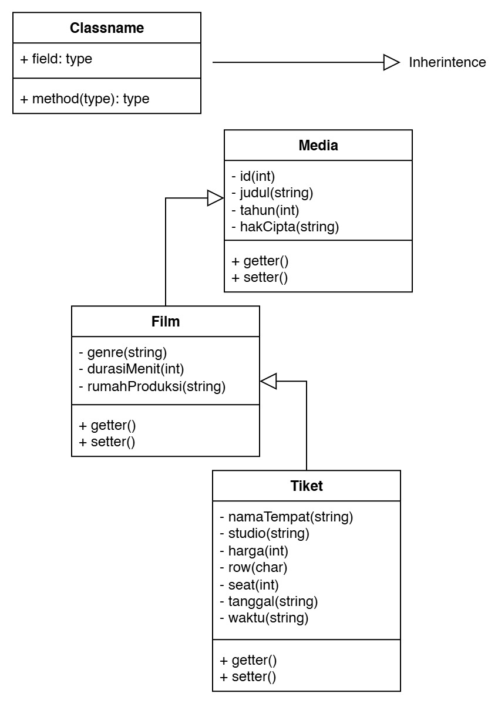

## Penjelasan Atribut dan Method

### 1. Class `Media` (Superclass)
* **Atribut:**
  * `id` (`int`): Menyimpan ID unik dari objek media.
  * `judul` (`string`): Menyimpan judul dari media.
  * `tahun` (`int`): Menyimpan tahun rilis dari media.
  * `hakCipta` (`string`): Menyimpan informasi pemegang hak cipta media.
* **Method:**
  * `getter()`: Mengambil nilai dari masing-masing atribut terproteksi/privat.
  * `setter()`: Mengubah atau menetapkan nilai atribut terproteksi/privat.

### 2. Class `Film` (Subclass dari `Media`)
* **Atribut:**
  * `genre` (`string`): Menyimpan jenis atau genre film (misal: Sci-Fi, Action).
  * `durasiMenit` (`int`): Menyimpan durasi waktu tayang film dalam satuan menit.
  * `rumahProduksi` (`string`): Menyimpan nama studio atau rumah produksi yang memproduksi film.
* **Method:**
  * `getter()`: Mengambil nilai atribut khusus pada class Film.
  * `setter()`: Mengubah atau menetapkan nilai atribut khusus pada class Film.

### 3. Class `Tiket` (Subclass dari `Film`)
* **Atribut:**
  * `namaTempat` (`string`): Menyimpan nama bioskop/tempat pemutaran.
  * `studio` (`string`): Menyimpan nama atau nomor studio tayang.
  * `harga` (`int`): Menyimpan harga tiket (dalam Rupiah).
  * `row` (`char`): Menyimpan huruf baris kursi penonton (A-J).
  * `seat` (`int`): Menyimpan nomor kursi penonton (1-14).
  * `tanggal` (`string`): Menyimpan tanggal penayangan film (YYYY-MM-DD).
  * `waktu` (`string`): Menyimpan jam tayang film (HH:MM).
* **Method:**
  * `getter()`: Mengambil nilai atribut khusus pada class Tiket.
  * `setter()`: Mengubah atau menetapkan nilai atribut khusus pada class Tiket.

---

## Penjelasan Alur Program

1. **Inisialisasi Data:** Program akan memuat data dummy awal untuk Master Film dan Daftar Tiket menggunakan konsep OOP (*Multilevel Inheritance* dari `Media` -> `Film` -> `Tiket`).
2. **Menampilkan Menu Utama:** Pengguna disajikan menu interaktif untuk memilih tindakan yang diinginkan:
   * Menampilkan daftar master film.
   * Menampilkan daftar tiket yang tersedia.
   * Menambah data master film baru.
   * Menambah tiket baru berdasarkan film yang ada.
   * Keluar dari program.
3. **Pengolahan Master Film:** Saat menambahkan film baru, program menerima masukan detail film lalu menyimpannya ke dalam koleksi data master film.
4. **Pembuatan Tiket:** Saat membuat tiket baru, pengguna memilih film berdasarkan ID yang ada pada data master. Informasi film diturunkan (*inherited*) ke dalam objek tiket beserta detail tayang (bioskop, studio, kursi, harga, dan waktu).
5. **Format & Output Data:** Data ditampilkan dalam bentuk tabel yang tersusun rapi lengkap dengan format harga Rupiah dan kalkulasi tata letak otomatis.

---

# Dokumentasi

## Java
<h3>Menu</h3>
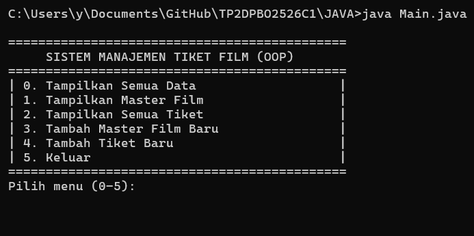
 Error Handling 
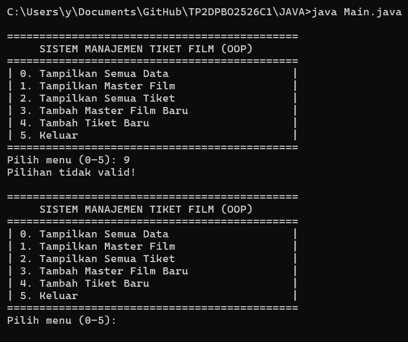 
<h3>Tampil Semua Data</h3>
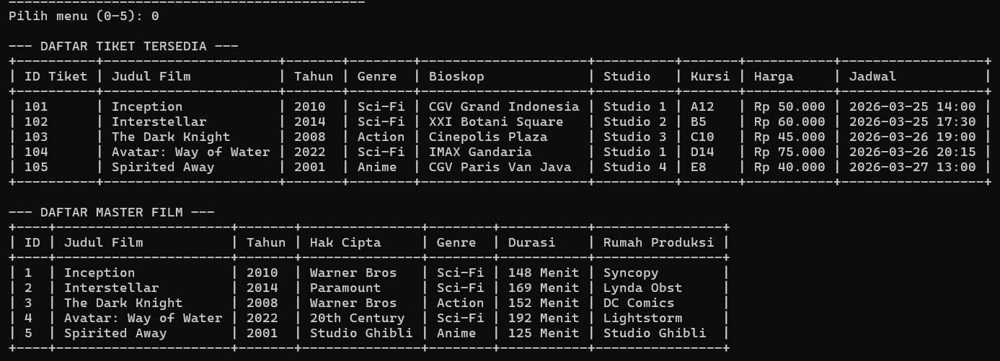 
<h3>Tampil Master Film</h3>
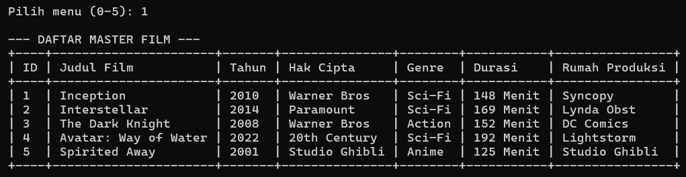 
<h3>Tampil Tiket Film</h3>
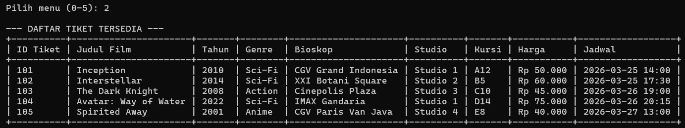 
<h3>Tambah Film</h3>
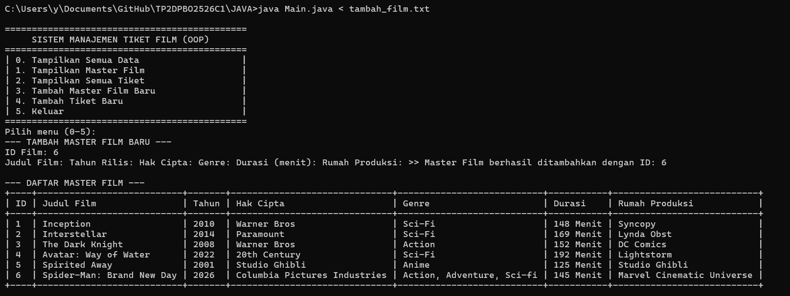 
 Error Handling 
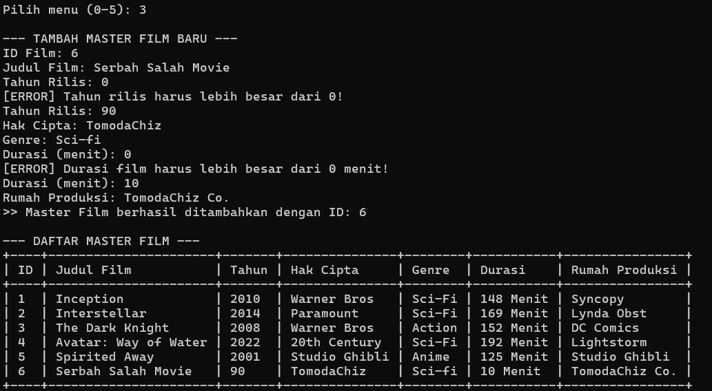 
<h3>Tambah Tiket Film</h3>
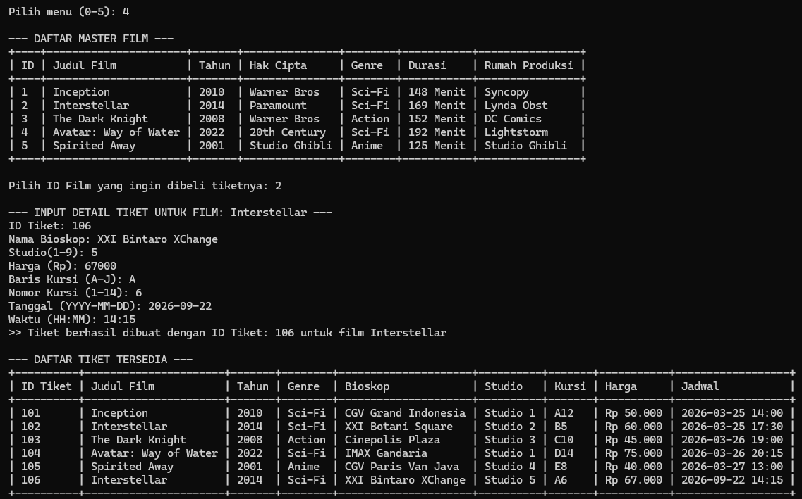 
 Error Handling 1 
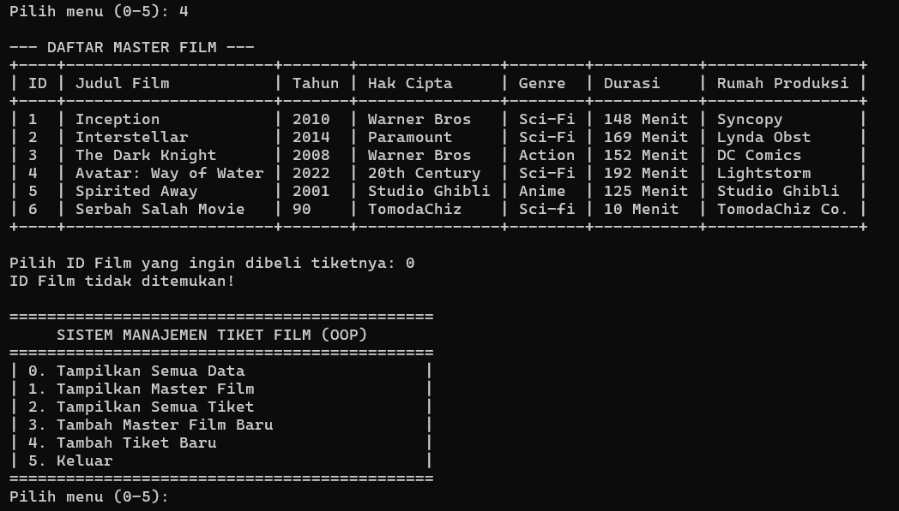
 Error Handling 2 
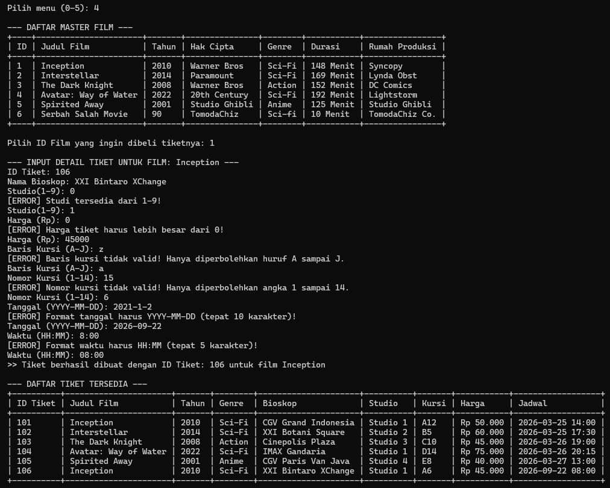 

<h2>CPP</h2>
<h3>Menu</h3>
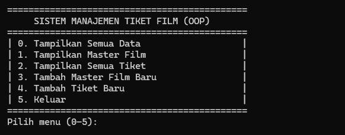
 Error Handling 
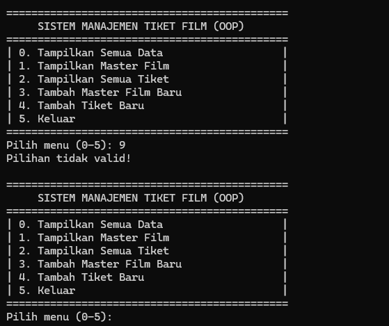 
<h3>Tampil Semua Data</h3>
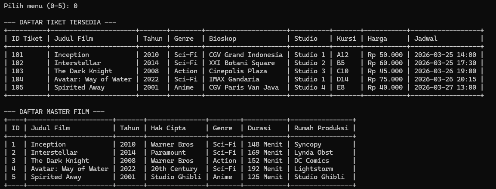 
<h3>Tampil Master Film</h3>
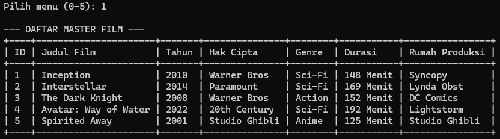 
<h3>Tampil Tiket Film</h3>
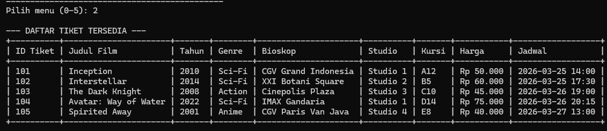 
<h3>Tambah Film</h3>
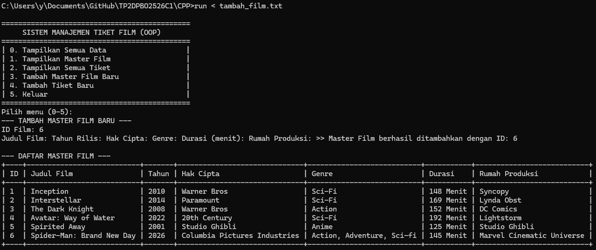 
 Error Handling 
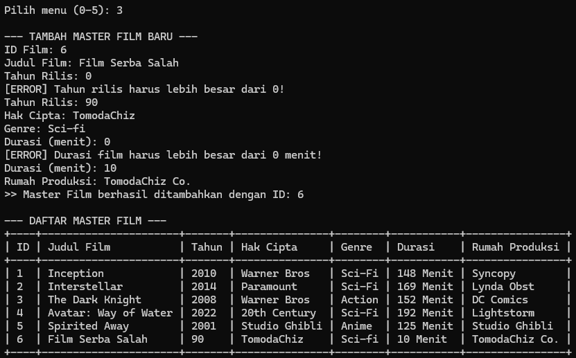 
<h3>Tambah Tiket Film</h3>
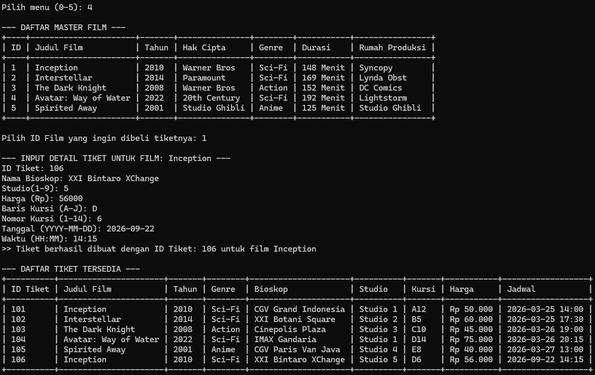 
 Error Handling 1 
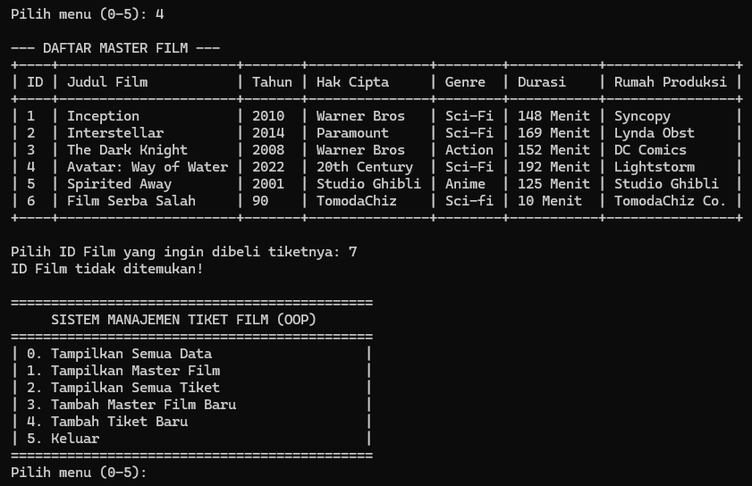
 Error Handling 2 
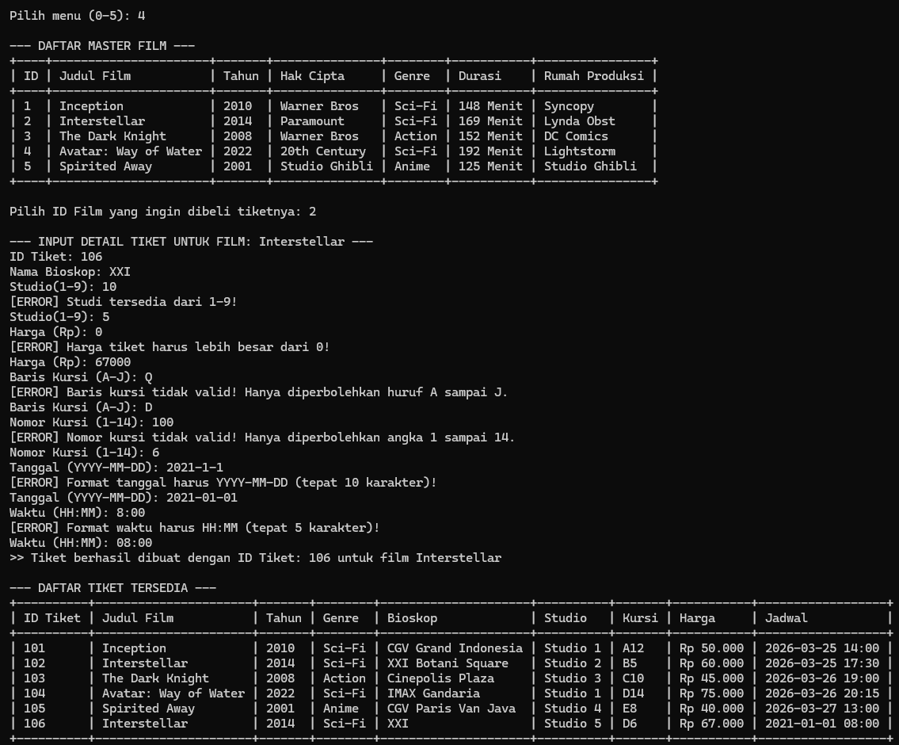 

